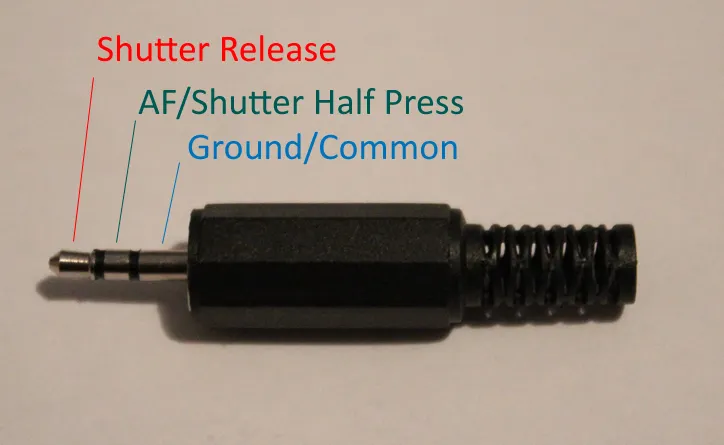

Intervalometer for a CANON rebel T5. Uses a manual trigger cord (Tip-Ring-Sleeve TRS cord) and connects a relay to its wires. See this [instructables](https://www.instructables.com/How-to-build-a-shutter-release-cable-for-the-Canon/) for a general idea of how it works. Just connect the Shutter Release and AF wires to the ground every 1 minute and release and boom you have an image.

   